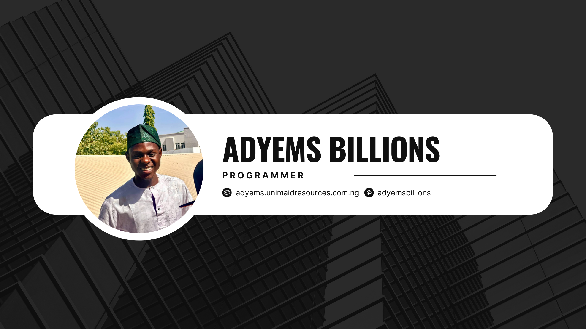

# Hello World!, I'm Adyems Billions, a Nigerian Web & App Developer 👋🏼:

🛜 Currently working on a customer support chat system and property management platform  
👨🏼‍🎓 Studying Computer Engineering as an undergraduate in Nigeria  
👨🏼‍💻 Building web and mobile applications since 2022  
🎯 Passionate about creating secure, user-friendly solutions for real-world problems

---

# 💻 Tech Stack:

---

# 📈 GitHub Stats

---

# 🔗 Connect With Me

---

## 🧠 My Work Ethic

✨ I value strong client relationships built on trust and communication  
✨ I enjoy collaborative work with teams  
✨ I continuously seek to expand my technical skillset  
✨ I’m especially focused on Laravel, PHP, Tailwind CSS, Bootstrap, MySQL, and modern front-end frameworks

---

## 🙋 Ask Me About

- Laravel, React, Flutter
- Full-Stack Web Development
- Building REST APIs
- App Design & UI Best Practices

---

    

<picture>
  <source media="(prefers-color-scheme: dark)" srcset="https://raw.githubusercontent.com/tobiasmeyhoefer/tobiasmeyhoefer/output/github-snake-dark.svg" />
  <source media="(prefers-color-scheme: light)" srcset="https://raw.githubusercontent.com/tobiasmeyhoefer/tobiasmeyhoefer/output/github-snake.svg" />
  
</picture>
